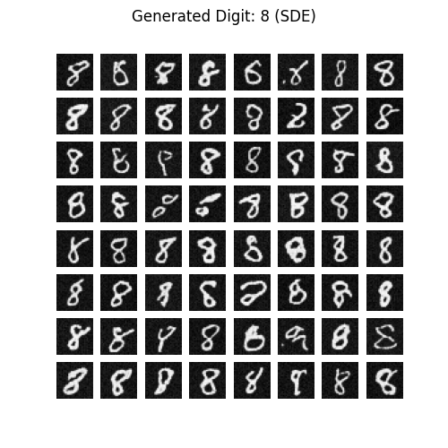
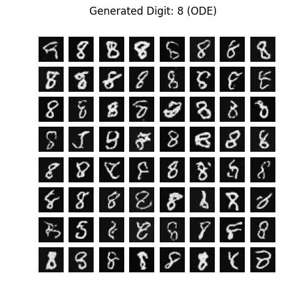
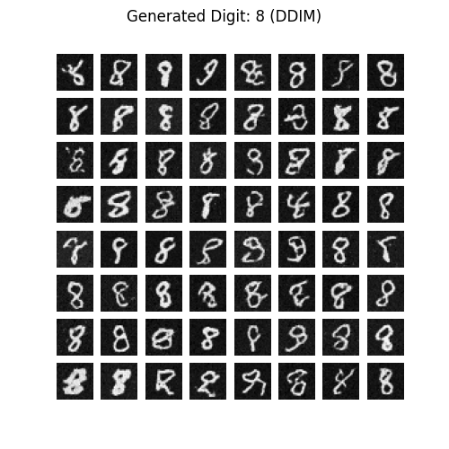

# Guided MNIST Diffusion: From SDE to ODE

An implementation of a Conditional Score-based Diffusion Model using a Transformer-enabled UNet architecture. This project explores the mathematical and visual differences between three major sampling strategies: Stochastic Differential Equations (SDE), Ordinary Differential Equations (ODE), and Denoising Diffusion Implicit Models (DDIM).


## Overview

Unlike standard GANs, this model learns to reverse a diffusion process. It predicts the Score Function (the gradient of the log-density of the data) to navigate from pure Gaussian noise back to a structured MNIST digit, guided by a class label.

### Key Features:
- **Hybrid Architecture:** A UNet backbone integrated with Spatial Self-Attention and Label Cross-Attention (Transformer blocks).
- **Time Embeddings:** Uses Gaussian Fourier Projections to inject continuous time \( t \) into every layer.
- **Multi-Sampler Analysis:** Side-by-side comparison of Stochastic (Langevin) vs. Deterministic (Probability Flow) inference.


## Architecture

The model uses a "U" shaped encoder-decoder. At the bottleneck and lower resolutions, we utilize Transformer blocks to allow the model to learn global dependencies (eg, ensuring the top and bottom of an '8' connect correctly).

- **Encoder:** Convolutions + GroupNorm + Time Injection.  
- **Bottleneck:** Self-Attention + Cross-Attention with Digit Labels.  
- **Decoder:** Transposed Convolutions + Skip Connections.


## Sampler Analysis

The core of this project is the analysis of how we "walk" back to the data manifold.

### 1. SDE Sampler (Langevin Dynamics)
**The Stochastic Approach.** It adds noise back at each step to ensure the model explores the full data distribution.  
**Observation:** Most natural results, high diversity, but slower convergence (~500 steps).

### 2. ODE Sampler (Probability Flow)
**The Deterministic Approach.** It treats the reverse process as a smooth, non-random trajectory.  
**Observation:** Highly efficient. However, it is sensitive to model training at \( t \approx 0 \), sometimes leaving a "grainy" texture if the model hasn't fully converged.

### 3. DDIM Sampler (Implicit Model)
**The Accelerated Approach.** It predicts the "clean image" \( x_0 \) at each step to take larger jumps.  
**Observation:** extremely fast (25–50 steps). Requires a well-tuned noise schedule; otherwise, it can lead to numerical instability ("ghosting").


## Results

<p float="left">
  
  
  
</p>

## Usage

### Requirements
```bash
pip install torch torchvision tqdm matplotlib
```

## Training

To train the model from scratch on MNIST:

```bash
python main.py --mode train
```
## Sampling
Generate digits using different mathematical strategies:

SDE (Standard):
```bash
python main.py --mode sample --sampler sde --digit 8 --steps 500
```

ODE (Almost):
```bash
python main.py --mode sample --sampler ode --digit 5 --steps 500
```

DDIM (Experimental):
```bash
python main.py --mode sample --sampler ddim --digit 3 --steps 100
```


